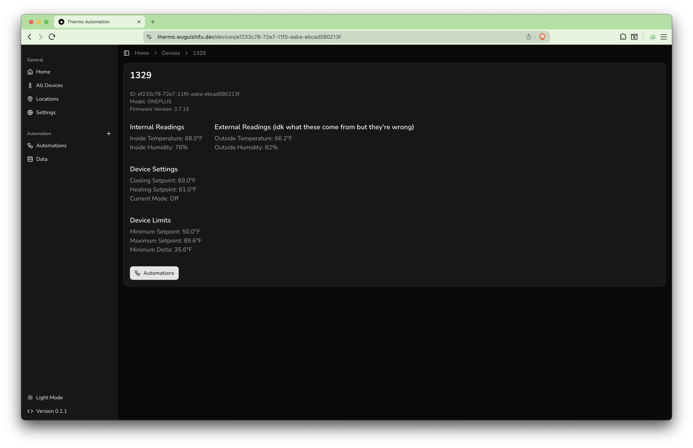
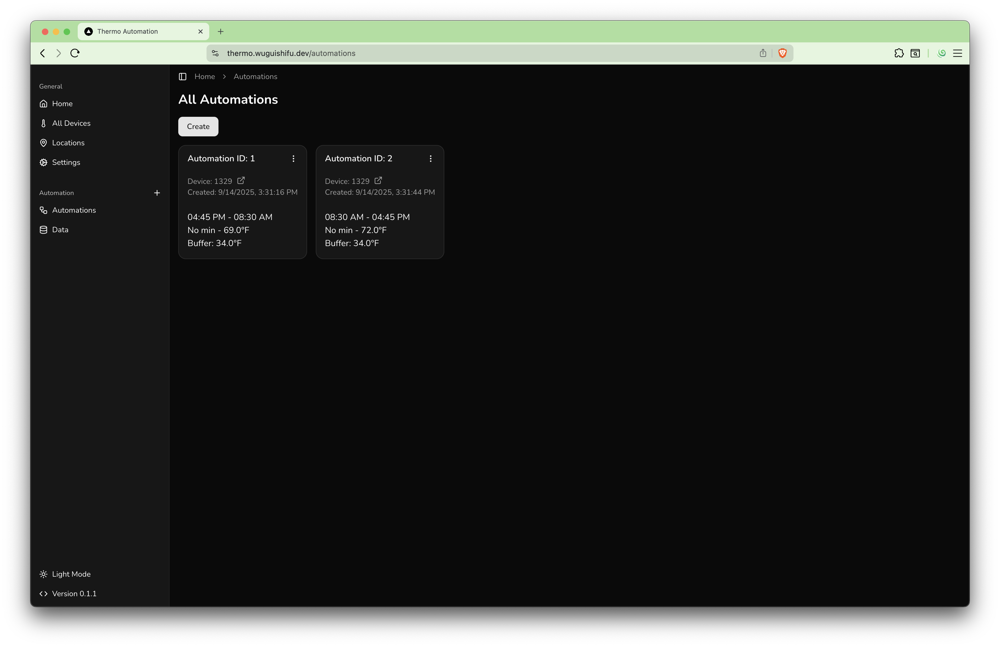
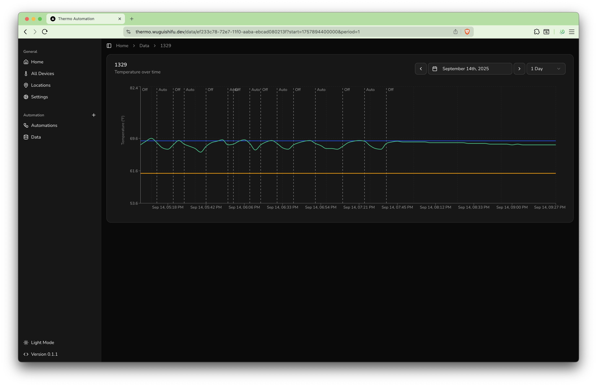

# Thermo Automation

This is a self-hostable project to automate Daikin thermometers.

## Todo

- [ ] Remove mode change line labels and just make them different colors with a key.

## Info

[Daikin One API Documentation](https://www.daikinone.com/openapi/documentation/index.html)

